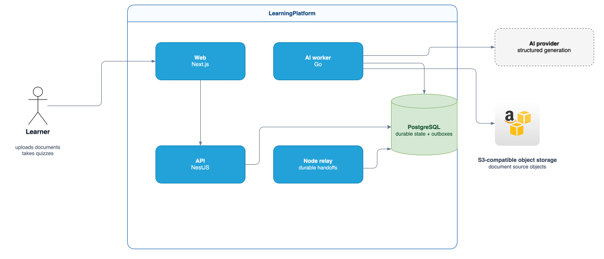
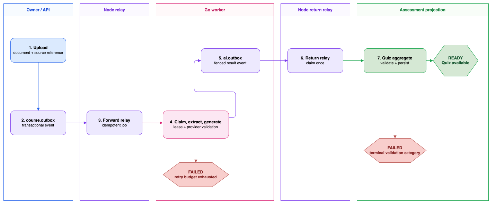
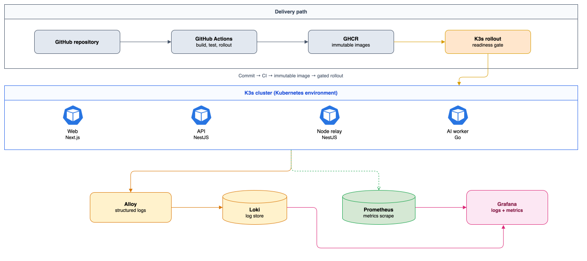

# LearningPlatform

  

  
  

> An engineering-focused learning platform that turns PDF and plain-text documents into grounded, single-select multiple-choice quizzes.

LearningPlatform is a portfolio project built to explore a realistic asynchronous AI workflow: upload a document, extract and chunk its content, generate structured questions with citations, then make the quiz available only after the result has been validated and persisted. The emphasis is on explicit contracts, durable handoffs, and failure-aware operations rather than treating an LLM call as a synchronous feature.

## What is implemented

- Document upload and asynchronous processing for PDF and plain text.
- Grounded MCQ generation with a citation back to the extracted source chunk.
- A NestJS API and Node relay runtime separated from a Go AI worker.
- PostgreSQL-backed work claiming, leases, idempotency, bounded technical retries, and durable outbox handoffs.
- Aggregate-level question validation before quiz persistence.
- Containerized deployment workflows and structured-log observability for the deployed workloads.

This is an active MVP engineering project, not a hosted public SaaS offering. The web application contains both integrated product flows and mock/prototype routes used to explore the learning experience; those prototype screens should not be read as claims of a complete production feature set.

## Technology stack

  

The stack is intentionally split by responsibility: Next.js serves the learner experience, NestJS owns the API and relay boundaries, and the Go worker handles long-running AI processing outside the HTTP request path.

| Area | Choice | Why it is here |
| --- | --- | --- |
| Learner application | Next.js and TypeScript | Server-rendered React application for the learner-facing experience. |
| API and relays | NestJS, TypeScript, PostgreSQL | Modular API boundary plus durable forward/return relay runtimes. |
| AI execution | Go | A separate worker process for leased jobs, controlled concurrency, and graceful shutdown. |
| Source files | S3-compatible object storage | Keeps uploaded files out of the relational database. |
| Operations | Docker images, K3s, GitHub Actions, Alloy, Loki, Prometheus, Grafana | A compact deployment and observability stack for the MVP. |

## System context

The database is deliberately the durable handoff boundary for the MVP. The API owns document-facing operations; the Go worker performs extraction and generation; the Node relays move results across schema boundaries without a distributed transaction. This keeps the operational topology small while making replay and ownership rules explicit.

## Document lifecycle

The workflow intentionally uses at-least-once delivery. Idempotency keys, attempt fencing, and transactional outboxes make duplicate delivery recoverable. A final validation failure is terminal for that result; a user-initiated retry creates a new processing attempt instead of reviving a stale delivery.

## Deployment and observability

The deployment footprint is intentionally modest: stateless application workloads, managed PostgreSQL, object storage, and an existing metrics/logs stack. Operational logs are structured and designed to expose event category and correlation metadata without including document content, prompts, provider responses, or credentials.

## Engineering decisions worth exploring

| Concern | Approach in this repository |
| --- | --- |
| Long-running AI work | Keep it outside the HTTP request path and process it through a durable PostgreSQL queue. |
| Cross-schema handoffs | Use transactional outboxes and idempotent relays instead of a cross-schema transaction. |
| Duplicate delivery | Use idempotency keys plus attempt/lease fencing. |
| Generated-content quality | Enforce structural MCQ invariants in the quiz aggregate before persistence. |
| Worker ownership | The Go worker writes AI-owned data; the Node return relay is the only runtime that projects the result back to the course state. |
| Failure handling | Retry only classified technical failures; retain terminal outcomes and preserve safe operational signals. |

## Repository guide

| Path | Purpose |
| --- | --- |
| [`app/`](app/) | NestJS API, modular domain code, relays, persistence, and tests. |
| [`web/`](web/) | Next.js learner-facing application; includes integrated flows and UI prototypes. |
| [`worker/`](worker/) | Go worker for job claiming, extraction, chunking, generation, and AI-side persistence. |
| [`infra/`](infra/) | Infrastructure and observability configuration. |
| [`docs/`](docs/) | Product, domain, service, AI, and architecture decision records. |

For a deeper technical walkthrough, start with the [architecture map](docs/00-README.md), [service design](docs/03-service-design.md), [AI architecture](docs/05-ai-architecture.md), and the ADRs for the [durable work queue](docs/adr/0023-postgresql-durable-work-queue-contract.md) and [idempotent assessment handoff](docs/adr/0014-ai-assessment-handoff-idempotency.md).

## License

This repository is public for portfolio presentation, technical review, educational study, and recruitment evaluation. It is **not open source**.

You may inspect, download, or clone the repository solely for those purposes. Forking is permitted only for personal reading or learning and may not be used for hosting, deploying, republishing, redistributing, or creating derivative projects. Modifying, sublicensing, selling, reselling, or commercially using the original source code requires prior written permission.

Third-party dependencies, libraries, icons, fonts, images, and other external materials remain subject to their respective licenses. See [`LICENSE`](LICENSE) for the complete terms.

For permission requests, contact [Huỳnh Ngọc Phát](mailto:ngocphat076@gmail.com) or visit [me.sirobabycloud.io.vn](https://me.sirobabycloud.io.vn).

## Current boundaries and next steps

- The implemented document path is PDF/plain text; video, audio, STT, OCR, broader retrieval, and broker-based scaling remain roadmap work.
- The MVP optimizes for transparent recovery and operability over throughput maximization.

## Credits

Technology icons are provided by [Skill Icons](https://github.com/tandpfun/skill-icons) and rendered through [skillicons.dev](https://skillicons.dev).
