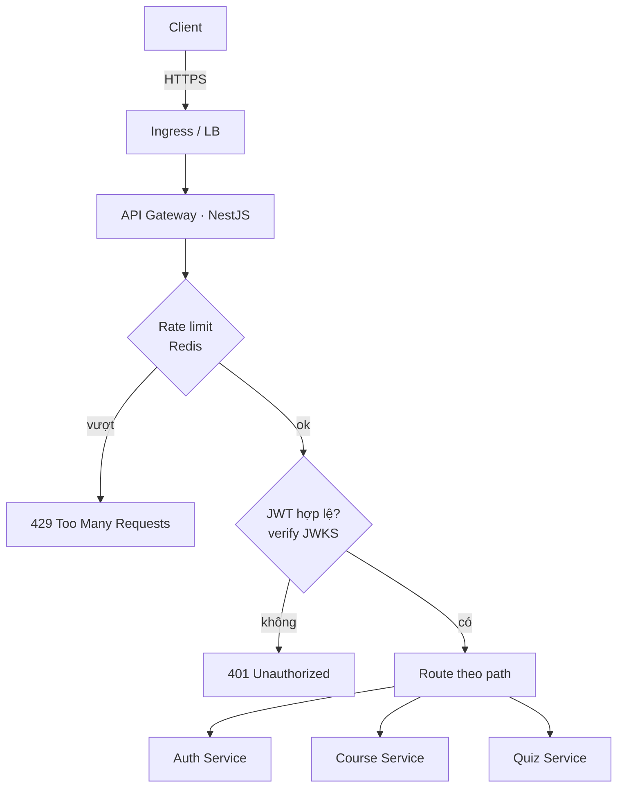
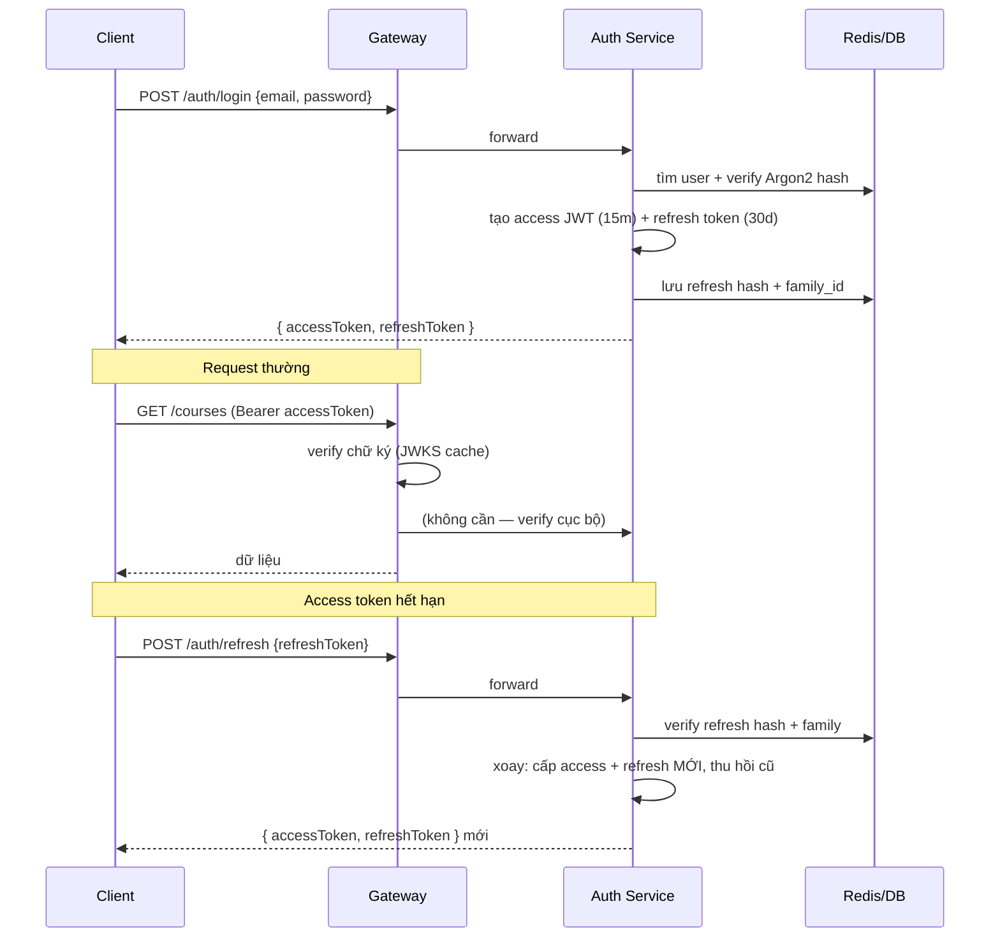
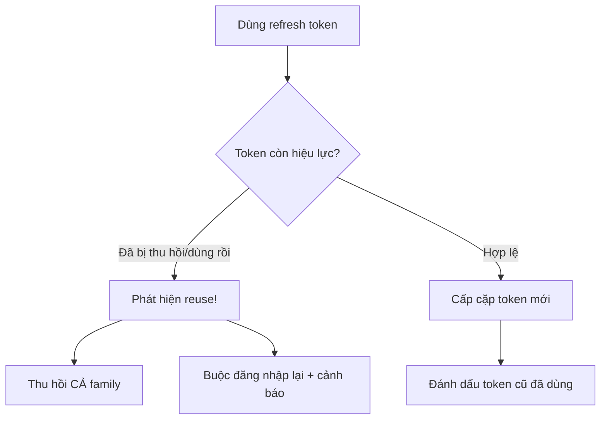
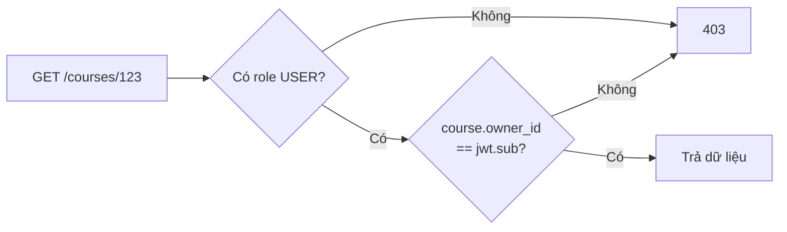
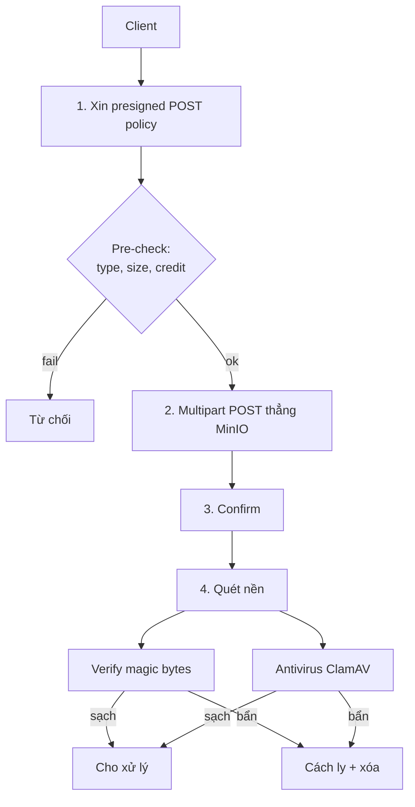
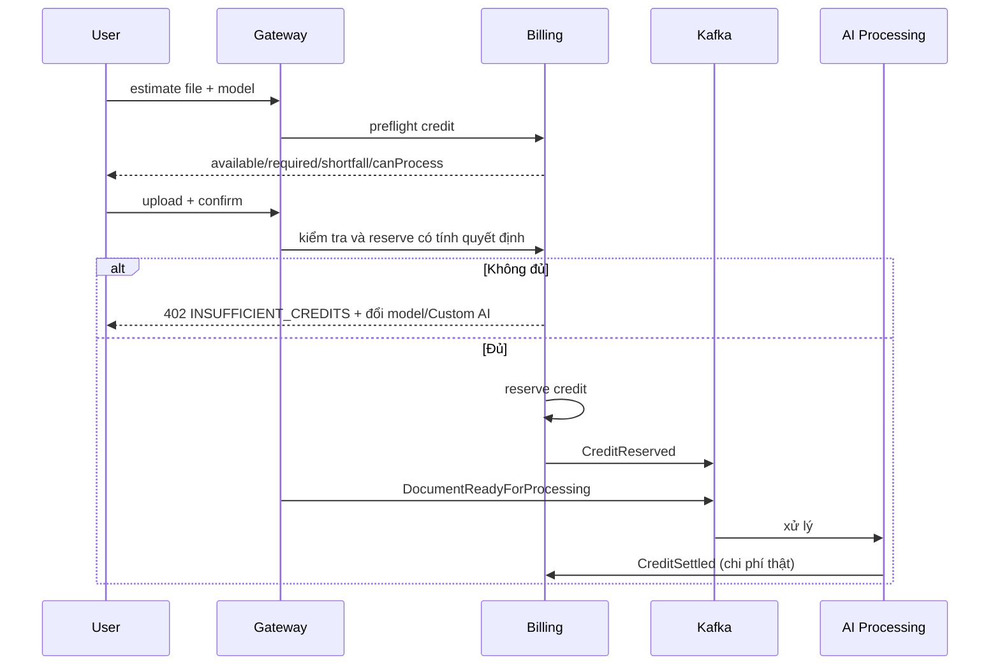

# 07 — API & Security Design

> Mục tiêu: thiết kế REST API, routing qua Gateway, luồng xác thực/phân quyền, và toàn bộ lớp bảo mật (JWT, refresh token, RBAC, file upload, chống abuse AI). Bảo mật ở đây không phải tính năng phụ — với platform xử lý tài liệu người dùng + tốn tiền inference, nó là sống còn.

> **Nguyên tắc triển khai:** Các security boundary được code production-grade theo đúng phase, nhưng production traffic chỉ được mở sau core phases Phase 0-6 và production launch gate. Identity stub chỉ dùng trong local/test khi bật `IDENTITY_MODE=stub` explicit; không phải cơ chế xác thực shared dev hay production.

---

## 1. Nguyên tắc API

| Nguyên tắc | Áp dụng |
|-----------|---------|
| REST + JSON, versioned | `/api/v1/...`; đổi breaking → `/v2` |
| Một entry point | Mọi request qua Gateway; service nội bộ không expose ra ngoài |
| Stateless auth | JWT tự chứa, verify bằng public key (JWKS) |
| Consistent error | RFC 7807 Problem Details (`type`, `title`, `status`, `detail`, `traceId`) |
| Pagination | cursor-based cho list dài (course, attempt history) |
| Idempotency | header `Idempotency-Key` cho POST tạo tài nguyên/tốn tiền |
| Rate limit headers | `X-RateLimit-Remaining`, `Retry-After` |

---

## 2. REST API Surface (đại diện)

```
# Auth (Spring Boot)
POST   /api/v1/auth/register
POST   /api/v1/auth/login            → { accessToken, refreshToken }
POST   /api/v1/auth/refresh
POST   /api/v1/auth/logout
GET    /api/v1/auth/me

# Documents & Courses (Course Service)
POST   /api/v1/documents/upload-url  → presigned multipart POST policy (MinIO)
PATCH  /api/v1/documents/{id}/model-selection
POST   /api/v1/documents/{id}/confirm → reserve credit trước enqueue
POST   /api/v1/documents/{id}/retry
GET    /api/v1/documents/{id}        → trạng thái xử lý (poll/SSE)
GET    /api/v1/documents             → list (cursor paginated)
GET    /api/v1/documents/{id}/quiz
POST   /api/v1/courses
GET    /api/v1/courses/{id}
GET    /api/v1/courses/{id}/chapters
GET    /api/v1/courses/{id}/checkpoints   → cho video player
POST   /api/v1/courses/{id}/progress

# Assessment & Tutor (Quiz Service)
GET    /api/v1/quizzes/{id}
POST   /api/v1/quizzes/{id}/attempts      → nộp bài (Idempotency-Key)
GET    /api/v1/flashcards/decks/{id}
POST   /api/v1/flashcards/{cardId}/review
POST   /api/v1/exams/generate             → async, trả jobId
POST   /api/v1/tutor/ask                  → { answer, citations[] }

# Analytics
GET    /api/v1/analytics/weak-topics
GET    /api/v1/analytics/summary

# Billing
GET    /api/v1/billing/wallet             → số dư credit
GET    /api/v1/billing/usage              → lịch sử dùng

# Owner Custom AI Settings
GET    /api/v1/settings/custom-ai
POST   /api/v1/settings/custom-ai
PATCH  /api/v1/settings/custom-ai/{id}
DELETE /api/v1/settings/custom-ai/{id}
POST   /api/v1/settings/custom-ai/{id}/verify

# Admin System Feature Setting
GET    /api/v1/admin/settings/custom-ai
PATCH  /api/v1/admin/settings/custom-ai   → chỉ bật/tắt toàn hệ thống
```

### 2.1. Contract trạng thái Document và Quiz

| Tình huống | HTTP | Mã lỗi | Hành vi client |
| --- | --- | --- | --- |
| Thiếu credit tại confirm | `402` | `INSUFFICIENT_CREDITS` | Hiển thị số thiếu; cho đổi model/Custom AI; không upload lại |
| Document `UPLOADED`/`PROCESSING`, chưa có Quiz | `409` | `QUIZ_NOT_READY` | Hiển thị trạng thái và tiếp tục theo dõi |
| Document `FAILED` | `409` | `DOCUMENT_PROCESSING_FAILED` | Hiển thị nguyên nhân an toàn và `retryable` |
| Document không tồn tại/không thuộc Owner | `404` | `DOCUMENT_NOT_FOUND` | Không tiết lộ ownership |
| Document `READY` nhưng thiếu Quiz | `500` | `QUIZ_INVARIANT_VIOLATION` | Hiển thị lỗi hệ thống, log/alert theo `traceId` |

Error response dùng RFC 7807 và bổ sung `code`, `retryable`, metadata an toàn theo lỗi. Với `INSUFFICIENT_CREDITS`, metadata gồm `availableCredits`, `requiredCredits`, `shortfallCredits`. Không dùng `404` để biểu diễn Quiz chưa được tạo do processing chưa xong hoặc đã thất bại.

**Bất đồng bộ cho việc nặng:** Upload và sinh nội dung là async. Client nhận `jobId`, theo dõi qua:
- **Polling:** `GET /documents/{id}` trả `status` + `progress`.
- **SSE/WebSocket (tốt hơn):** Gateway đẩy cập nhật tiến độ real-time khi nhận event `JobProgress` từ Kafka.

> **Bài học API:** Đừng để client gọi một API "sinh quiz" rồi chờ 60 giây (timeout, UX tệ). Trả `202 Accepted + jobId` ngay, rồi push tiến độ. Mọi việc tốn >vài giây phải async. Đây là khác biệt giữa API "demo" và API "production".

---

## 3. Gateway Routing & trách nhiệm



**Gateway làm gì (theo thứ tự middleware):**
1. Terminate TLS, CORS, security headers (HSTS, CSP).
2. Inject `correlationId` (trace toàn hệ thống).
3. Rate limit (Redis sliding window) — chặn abuse *trước* khi tốn tài nguyên downstream.
4. Verify JWT (chữ ký qua JWKS cache; **không** gọi Auth mỗi request).
5. (Thiết kế legacy trước Issue #108) Trích claims (userId, roles) → forward downstream qua header nội bộ đã ký. Luồng hiện tại dùng session bearer token qua BFF và mTLS cho internal route.
6. Route + timeout + retry (cho GET idempotent) + circuit breaker.

**Gateway KHÔNG làm:** business logic, truy cập DB nghiệp vụ, authorization chi tiết theo tài nguyên (việc đó ở service sở hữu tài nguyên).

> **Bài học:** Verify JWT bằng public key tại Gateway là chìa khóa cho **stateless, scale ngang**. Nếu mỗi request phải hỏi Auth "token này hợp lệ không", Auth thành bottleneck và điểm lỗi đơn. JWKS cache (xoay key định kỳ) cho phép verify cục bộ. Đây là lý do JWT thắng session token trong kiến trúc phân tán.

---

## 4. Authentication Flow



**Token design:**

| Token | Thời hạn | Lưu ở đâu | Chứa gì |
|-------|----------|-----------|---------|
| Access JWT | 15 phút | client (memory) | userId, roles, tenantId, exp |
| Refresh token | 30 ngày | client (httpOnly cookie nếu web) + hash ở server | random opaque, family_id |

**Access JWT claims (rút gọn):**

```json
{
  "sub": "userId",
  "roles": ["USER"],
  "tenantId": "userId-hoặc-orgId",
  "plan": "FREE",
  "iat": 1717660800,
  "exp": 1717661700,
  "iss": "auth.learningplatform",
  "kid": "key-2026-06"
}
```

> **Bài học token:** Access token **ngắn hạn** (15m) giảm thiệt hại nếu rò rỉ — kẻ trộm chỉ dùng được 15 phút. Refresh token **dài hạn nhưng thu hồi được** (lưu hash ở server). Nhúng `plan`/`roles` vào JWT để Gateway/service quyết định nhanh mà không query DB — nhưng nhớ: thông tin trong token có thể "cũ" tới 15 phút (vd user vừa nâng cấp plan). Với dữ liệu nhạy cảm về quyền, verify lại ở service.

---

## 5. Refresh Token Rotation & chống đánh cắp



Cơ chế **token family**: mỗi lần login tạo một `family_id`. Mỗi lần refresh, token cũ bị đánh dấu "đã dùng" và cấp token mới cùng family. Nếu một token "đã dùng" bị dùng lại (dấu hiệu bị đánh cắp) → **thu hồi toàn bộ family** → kẻ tấn công lẫn nạn nhân đều phải đăng nhập lại (an toàn hơn là để kẻ tấn công tiếp tục).

> **Bài học:** Đây là chỗ học bảo mật thực chiến. Refresh token rotation + reuse detection là chuẩn công nghiệp (OAuth BCP). Không rotation → refresh token dài hạn bị lộ = toang lâu dài. Có rotation + family → hệ thống tự phát hiện và cắt đứt khi có dấu hiệu trộm token.

---

## 6. Authorization & RBAC

Phân quyền theo 2 tầng:

**Tầng 1 — RBAC (vai trò):** Gateway/service kiểm role từ JWT.

| Role | Quyền |
|------|-------|
| `USER` | CRUD tài nguyên *của mình*; dùng AI trong quota |
| `ADMIN` | Quản trị hệ thống, xem DLQ, replay job, quản lý user |

**Tầng 2 — Ownership (sở hữu tài nguyên):** Mỗi service kiểm `resource.owner_id == jwt.sub` (hoặc cùng `tenantId`). Đây là phân quyền *quan trọng nhất* trong B2C — đảm bảo user A không đọc tài liệu/quiz của user B.



**Lưới an toàn cuối: PostgreSQL RLS.** Dù app đã kiểm ownership, bật Row-Level Security với policy `owner_id = current_setting('app.user_id')` → nếu code quên `WHERE owner_id`, DB vẫn chặn. Defense-in-depth.

> **Bài học:** Trong B2C, lỗ hổng phổ biến và nguy hiểm nhất là **IDOR** (Insecure Direct Object Reference) — đổi `/courses/123` thành `/courses/124` đọc được dữ liệu người khác. RBAC một mình **không** chống được IDOR (cả hai đều là USER). Phải kiểm ownership ở mọi truy cập tài nguyên. RLS là lớp lưới cuối khi code sót.

---

## 7. File Upload Security

Đây là bề mặt tấn công lớn nhất — người dùng đưa file tùy ý vào hệ thống.



| Lớp bảo vệ | Chi tiết |
|-----------|---------|
| **Presigned POST policy** | Client gửi `multipart/form-data` trực tiếp tới MinIO bằng `uploadUrl` + signed `uploadFields`; policy ràng buộc exact key, MIME type, kích thước và thời hạn; app không proxy file |
| **Whitelist MIME + magic bytes** | Không tin `Content-Type` client gửi; đọc magic bytes thật (chống đổi đuôi .exe → .pdf) |
| **Giới hạn kích thước** | Theo plan (Free nhỏ hơn); chặn ở presigned policy |
| **Antivirus** | Quét ClamAV trước khi xử lý |
| **Cách ly** | File gốc lưu bucket riêng, không public; xử lý trong worker sandbox |
| **Path/name sanitization** | Sinh tên object ngẫu nhiên (UUID), không dùng tên file gốc làm path → chống path traversal |
| **Bóc tách nội dung an toàn** | Parser PDF/Office chạy với quyền tối thiểu, timeout, giới hạn bộ nhớ (chống zip bomb / file độc) |

> **Bài học:** Hai sai lầm chết người: (1) tin `Content-Type` của client — kẻ tấn công đổi đuôi dễ dàng, phải đọc magic bytes; (2) dùng tên file người dùng làm đường dẫn lưu — mở đường path traversal (`../../etc/...`). Luôn sinh tên ngẫu nhiên + verify nội dung thật. File upload là nơi "không tin gì từ client" phải áp dụng tuyệt đối.

**Upload contract:** Client gọi estimate trước upload để nhận `availableCredits`, `requiredCredits`, `shortfallCredits`, `canProcess`. Nếu `canProcess=false` với Platform Model, client không bắt đầu upload và phải đưa lựa chọn Custom AI, file nhỏ hơn hoặc thay đổi gói/credit. `POST /documents/upload-url` trả `uploadUrl`, `uploadFields`, `documentId`, `expirySec`. Client thêm toàn bộ `uploadFields` vào `FormData`, thêm `file` cuối cùng rồi `POST` tới `uploadUrl`. Sau khi storage trả thành công, client gọi `/documents/{id}/confirm`; confirm kiểm tra object và reserve platform credit trước enqueue. Nếu balance giảm sau preflight, confirm trả `402` và giữ Document ở `UPLOADED` để đổi model rồi thử lại mà không upload lại.

---

## 8. AI Abuse Prevention

AI tốn tiền thật → abuse = cháy túi. Đây là lớp bảo vệ kinh tế.

| Vector abuse | Phòng chống |
|--------------|-------------|
| **Spam upload** (đốt STT/LLM) | Hard quota theo **phút STT + token LLM/tháng** theo plan; chặn *trước* khi enqueue |
| **Upload file khổng lồ** | Giới hạn size + thời lượng video theo plan |
| **Tutor spam** (hỏi liên tục) | Rate limit theo user + credit trừ mỗi câu hỏi |
| **Prompt injection** trong tài liệu | Tài liệu user là **dữ liệu**, không phải lệnh; tách biệt rõ trong prompt; không cho nội dung tài liệu điều khiển hành vi hệ thống |
| **Lạm dụng Free tier** (tạo nhiều account) | Verify email; giới hạn theo thiết bị/IP; theo dõi pattern |
| **Trích xuất prompt/IP** | Không lộ system prompt; lọc output |
| **Cost spike đột biến** | Circuit breaker theo tổng chi phí/giờ; alert + degrade sang model rẻ |

**Cơ chế quota trước khi tốn tiền:**



> **Bài học — quan trọng nhất mục này:** **Preflight trước upload, reserve tại confirm trước enqueue, settle sau xử lý.** Preflight tạo UX rõ nhưng không khóa số dư; confirm phải kiểm tra lại vì balance có thể thay đổi. Không reserve lúc cấp upload URL vì Owner có thể bỏ upload. Prompt injection: luôn coi nội dung tài liệu là *dữ liệu không tin cậy*, đóng khung rõ trong prompt.

### 8.1. Custom AI security boundary

- Custom AI có ở Free và Paid nhưng vẫn chịu rate limit, ownership và feature flag toàn hệ thống.
- Admin chỉ bật/tắt `customAiEnabled`, không xem hoặc quản lý cấu hình của Owner và không tạo model dùng chung.
- API key lưu ciphertext, có version, không trả plaintext; response chỉ trả `hasApiKey`.
- Chỉ cấu hình `VERIFIED` mới được chọn. Verify request có timeout, giới hạn response và không tự retry.
- SaaS chặn metadata, loopback, link-local và private network, chống DNS rebinding và kiểm soát egress. Không gọi `localhost` của Owner.
- Xóa cấu hình dùng soft delete; attempt đang chạy tiếp tục bằng secret version đã khóa. Không log URL có credential, prompt, response hoặc secret.
- Phiên bản đầu chỉ hỗ trợ OpenAI-compatible. Anthropic native API, Claude Code và Local AI Connector không thuộc phạm vi.

---

## 9. Checklist bảo mật tổng hợp

| Hạng mục | Trạng thái MVP |
|----------|----------------|
| TLS everywhere (Ingress + mTLS nội bộ khi có mesh) | Bắt buộc |
| JWT ngắn hạn + refresh rotation + reuse detection | Bắt buộc |
| RBAC + ownership check + RLS | Bắt buộc |
| Rate limiting (Gateway, Redis) | Bắt buộc |
| File: presigned + magic bytes + AV + sanitize | Bắt buộc |
| AI: hard quota + reserve/settle + circuit breaker | Bắt buộc |
| Secrets trong K8s Secret/Vault, không hardcode | Bắt buộc |
| Input validation mọi endpoint | Bắt buộc |
| Audit log hành động nhạy cảm | Nên có |
| OWASP Top 10 review | Định kỳ |
| Mã hóa Custom AI key + SSRF/DNS-rebinding/egress guard | Bắt buộc khi mở Custom AI (ADR-0021) |

> **Bài học cuối:** Bảo mật là *defense-in-depth* — nhiều lớp, không một lớp nào hoàn hảo. JWT lộ thì có thời hạn ngắn; code quên ownership thì có RLS; client gửi MIME giả thì có magic bytes; quota bug thì có circuit breaker chi phí. Mỗi lớp giả định lớp trước có thể thủng. Đây là tư duy an ninh trưởng thành.

---

## 10. Liên kết sang tài liệu sau

- mTLS nội bộ + secrets → service mesh & K8s ở `08-infrastructure.md`.
- Quota/credit reserve-settle → mô hình tiền ở `10-monetization.md`.
- Cost circuit breaker → ngưỡng cụ thể ở `09-cost-analysis.md`.
