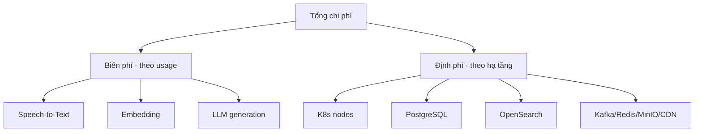
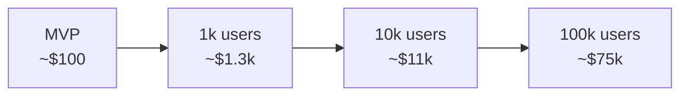

# 09 — Cost Analysis

> Mục tiêu: ước tính chi phí ở 4 quy mô (MVP, 1k, 10k, 100k users). Đây là tài liệu quyết định sản phẩm có sống được không. Một startup AI chết vì unit economics âm, không vì kiến trúc.
>
> **Lưu ý:** Mọi con số dưới đây là **ước lượng bậc độ lớn** (order-of-magnitude) tại thời điểm thiết kế, dùng để ra quyết định — không phải báo giá. Giá API/hạ tầng thay đổi liên tục; hãy verify lại trước khi cam kết.

---

## 1. Hai loại chi phí

- **Biến phí (AI inference):** tỉ lệ thuận với mức dùng. Đây là phần *nguy hiểm* — không kiểm soát thì lỗ theo từng user.
- **Định phí (hạ tầng):** tương đối cố định theo bậc scale. Phần này dễ dự đoán.

> **Tư duy cốt lõi:** Ở quy mô nhỏ, **định phí** (hạ tầng K8s/DB) chiếm ưu thế → chi phí/user cao. Ở quy mô lớn, **biến phí** (AI) chiếm ưu thế → phải tối ưu inference. Chiến lược cost khác nhau ở mỗi bậc.

---

## 2. Chi phí biến đổi theo "đơn vị tài sản" (asset)

Đây là nền tảng mọi tính toán. Chuẩn hóa theo từng loại upload (giá API ước lượng, USD):

### Video/Audio 1 giờ

| Bước | Cách tính | Chi phí ước lượng |
|------|-----------|-------------------|
| STT (Whisper API) | 60 phút × $0.006 | **$0.36** |
| Embedding (~12k token) | 12k × $0.00002/1k | **~$0.0003** |
| Sinh quiz (~20 câu, model rẻ) | input ~15k + output ~5k token, Gemini Flash/4o-mini | **~$0.05–0.15** |
| Sinh checkpoint + summary + flashcard | thêm vài lần gọi model rẻ | **~$0.05–0.15** |
| **Tổng/video 1h (model rẻ)** | | **~$0.5–0.7** |
| **Tổng/video 1h (nếu dùng GPT-4o)** | generation đắt hơn ~10x | **~$1.5–2.5** |

### Tài liệu PDF/DOC (~30 trang, ~10k từ)

| Bước | Chi phí ước lượng |
|------|-------------------|
| Extraction (không LLM) | ~$0 |
| Embedding | ~$0.0003 |
| Sinh quiz + flashcard (model rẻ) | ~$0.05–0.12 |
| **Tổng/tài liệu** | **~$0.05–0.15** |

### Câu hỏi Tutor (RAG, mỗi lần hỏi)

| Bước | Chi phí ước lượng |
|------|-------------------|
| Embedding câu hỏi | ~$0.00001 |
| LLM trả lời (context ~3k + output ~500 token, model rẻ) | ~$0.002–0.01 |
| **Tổng/câu hỏi** | **~$0.002–0.01** |

> **Kết luận quan trọng nhất của cả tài liệu:** **STT là chi phí lớn nhất cho video** ($0.36/giờ, không cache được nếu nội dung mới). Generation đứng thứ hai và **kiểm soát được bằng model routing** (rẻ vs đắt chênh 10x). Vì vậy: (1) nếu video là use-case chính → cân nhắc self-host Whisper khi scale; (2) dùng model rẻ làm mặc định, chỉ "đốt" model mạnh cho câu khó. Đây là hai đòn bẩy margin lớn nhất.

---

## 3. Giả định hành vi người dùng

Để quy ra chi phí/user, cần giả định mức dùng trung bình/tháng (B2C học tập, tier trả phí điển hình):

| Hành vi | Free user/tháng | Paid user/tháng |
|---------|-----------------|-----------------|
| Video/audio xử lý | 1 video ngắn (~30 phút) | ~5 giờ |
| Tài liệu | 2-3 | ~15 |
| Câu hỏi Tutor | ~10 | ~150 |
| Quiz/exam làm | dùng lại nội dung đã sinh (rẻ) | dùng lại (rẻ) |

**Chi phí AI biến đổi/user/tháng (ước lượng, model rẻ + cache):**

| | Free | Paid |
|--|------|------|
| STT | ~$0.18 (0.5h) | ~$1.8 (5h) |
| Generation (ingest) | ~$0.10 | ~$0.8 |
| Tutor | ~$0.05 | ~$0.75 |
| **Tổng biến phí/user** | **~$0.33** | **~$3.35** |

> **Bài học:** Free user tốn ~$0.33/tháng *nếu được kiểm soát chặt*. Nếu Free cho upload video thoải mái → một user có thể tốn $5-10/tháng → 1000 free user = lỗ $5-10k/tháng. **Đây là lý do hard quota theo phút STT là sống còn**, không phải tùy chọn. Paid user ~$3.35 biến phí → giá bán phải > con số này + phần định phí phân bổ + margin.

---

## 4. Định phí hạ tầng theo bậc scale

Giả định triển khai trên cloud (giá VPS/managed ước lượng USD/tháng). Có thể rẻ hơn nhiều nếu tự host trên VPS Việt Nam.

### MVP (giai đoạn học, <100 user)

Khuyến nghị: **chưa cần K8s đầy đủ.** Chạy docker-compose trên 1-2 VPS lớn, hoặc K8s 1 node để học.

| Thành phần | Cấu hình | Chi phí/tháng |
|-----------|----------|---------------|
| Compute (1-2 VPS / 1 node K8s) | 4-8 vCPU, 16GB | $40–80 |
| PostgreSQL | shared trên VPS | (gộp) |
| Kafka + Redis + OpenSearch + MinIO | self-host trên VPS | (gộp) |
| CDN/domain (Cloudflare free) | | $0–20 |
| **Tổng định phí MVP** | | **~$50–100** |
| Biến phí AI (50 active, đa số free) | | ~$20–40 |
| **TỔNG MVP** | | **~$70–140/tháng** |

### 1.000 users (~100-200 paid)

| Thành phần | Chi phí/tháng |
|-----------|---------------|
| K8s cluster (3 node, 8 vCPU/16GB mỗi node) | $150–300 |
| PostgreSQL (primary + replica, managed nhỏ) | $50–100 |
| OpenSearch (1-2 node) | $80–150 |
| Kafka (3 broker nhỏ) / Redis / MinIO | $80–150 |
| CDN + băng thông | $20–50 |
| Observability (self-host) | (gộp node) |
| **Tổng định phí** | **~$400–750** |
| Biến phí AI (~150 paid × $3.35 + free) | ~$600–900 |
| **TỔNG 1k** | **~$1.000–1.650/tháng** |

### 10.000 users (~1.000-2.000 paid)

| Thành phần | Chi phí/tháng |
|-----------|---------------|
| K8s cluster (6-10 node + autoscale) | $800–1.500 |
| PostgreSQL HA (lớn hơn + read replica) | $300–600 |
| OpenSearch (3 node) | $400–800 |
| Kafka/Redis/MinIO (HA) | $400–700 |
| CDN + băng thông (video) | $200–500 |
| **Tổng định phí** | **~$2.100–4.100** |
| Biến phí AI (~1.500 paid + free funnel) | ~$6.000–10.000 |
| **TỔNG 10k** | **~$8.000–14.000/tháng** |

### 100.000 users (~10.000-20.000 paid)

| Thành phần | Chi phí/tháng |
|-----------|---------------|
| K8s (autoscale, nhiều node pool) | $5.000–10.000 |
| PostgreSQL (sharding/lớn + nhiều replica) | $2.000–4.000 |
| OpenSearch (cụm lớn) | $2.000–4.000 |
| Kafka/Redis/MinIO (cụm lớn) | $2.000–4.000 |
| CDN + băng thông video (lớn) | $2.000–5.000 |
| **Tổng định phí** | **~$13.000–27.000** |
| Biến phí AI (~15.000 paid; **self-host STT giảm mạnh**) | ~$40.000–70.000 |
| **TỔNG 100k** | **~$53.000–97.000/tháng** |

> **Bài học scale economics:** Để ý tỉ lệ đảo chiều. MVP: định phí >> biến phí (hạ tầng tối thiểu vẫn tốn, ít user). 100k: biến phí (AI) >> định phí. Nghĩa là **chiến lược tối ưu chi phí đổi theo bậc**: giai đoạn đầu tối ưu hạ tầng (đừng over-provision), giai đoạn sau tối ưu inference (self-host STT, cache mạnh, model routing). Tối ưu sai chỗ ở sai giai đoạn = lãng phí công sức.

---

## 5. Điểm hòa vốn & biên lợi nhuận

Giả sử giá Paid ~$5/tháng (≈120k VND — hợp túi tiền VN):

| Bậc | Paid users | Doanh thu/tháng | Chi phí/tháng | Lãi/lỗ |
|-----|-----------|-----------------|---------------|--------|
| MVP | ~10 | ~$50 | ~$100 | Lỗ nhẹ (chấp nhận — đang học) |
| 1k | ~150 | ~$750 | ~$1.300 | Lỗ nhẹ |
| 10k | ~1.500 | ~$7.500 | ~$11.000 | Lỗ → cần tối ưu hoặc tăng giá |
| 100k | ~15.000 | ~$75.000 | ~$75.000 | Hòa vốn → lãi nếu tối ưu |

> **Cảnh báo CTO:** Với giá $5 và chi phí hiện tại, **biên lợi nhuận rất mỏng tới âm** ở bậc giữa. Đây là thực tế của edtech giá thấp + AI đắt. Đường sống: (1) tỉ lệ free→paid cao, (2) self-host STT khi scale, (3) khuyến khích Custom AI/BYOM cho cả Free và Paid để chuyển inference cost sang Owner, (4) tier giá cao hơn cho power user. Custom AI là capability mở, không phải gói phí nền tảng riêng. Xem `10-monetization.md`.

---

## 6. Đòn bẩy giảm chi phí (xếp theo hiệu quả)

| Đòn bẩy | Tiết kiệm | Độ khó |
|---------|-----------|--------|
| **Content-hash cache** (không sinh lại) | Rất cao | Thấp — làm ngay |
| **Model routing** (rẻ mặc định) | Cao (tới 10x generation) | Thấp |
| **Hard quota** (chặn abuse) | Cao (chống lỗ free) | Thấp |
| **Custom AI/BYOM** (Owner gánh inference) | Rất cao (giảm biến phí nền tảng) | Trung bình |
| **Self-host Whisper STT** | Cao ở quy mô lớn | Cao (GPU ops) |
| **KEDA scale-to-zero** (AI worker) | Trung bình | Trung bình |
| **VPS Việt Nam thay cloud lớn** | Trung bình | Thấp |
| Self-host vs managed data services | Trung bình | Trung bình (đánh đổi ops) |

> **Bài học cuối:** Ba đòn bẩy đầu (cache, routing, quota) **rẻ để làm và hiệu quả ngay** — phải có từ MVP. Custom AI/BYOM giảm biến phí inference và mở rộng funnel nhưng không tự tạo doanh thu riêng. Self-host STT đáng làm khi video là use-case chính và đã đủ quy mô để bù chi phí GPU ops.

---

## 7. Liên kết sang tài liệu sau

- Credit model quy đổi STT-minute/token → credit → `10-monetization.md`.
- BYOM kiến trúc → `10-monetization.md`.
- Self-host STT, KEDA scale-to-zero → `08-infrastructure.md` + `11-roadmaps.md`.
