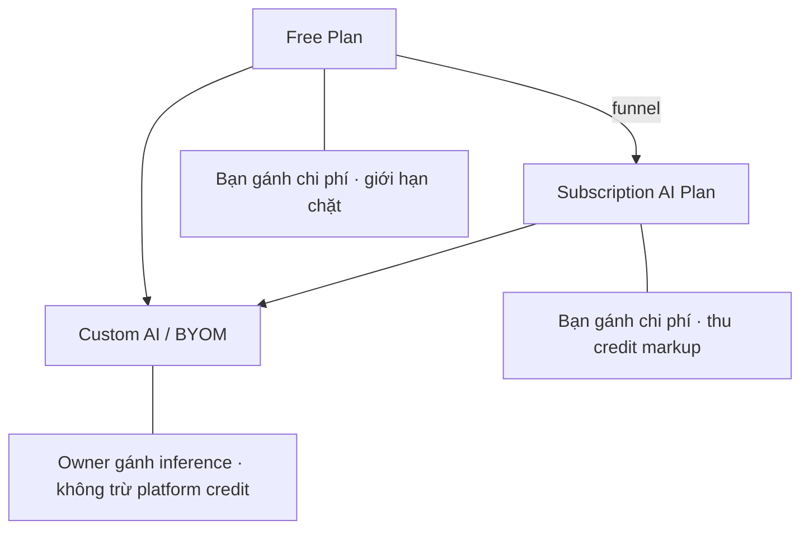
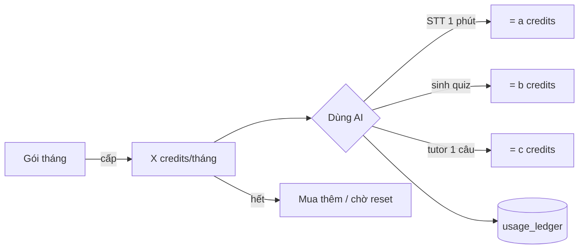
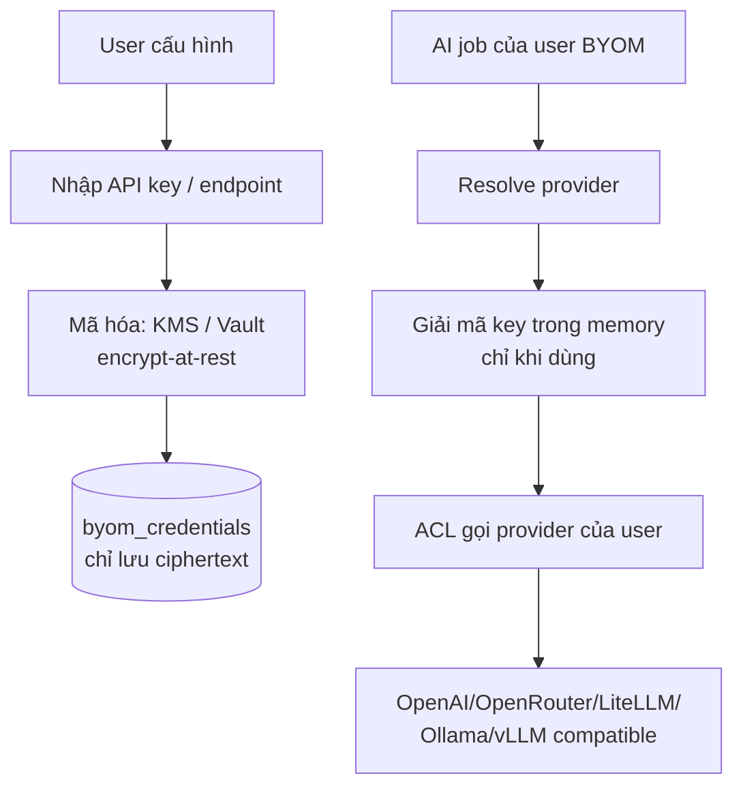
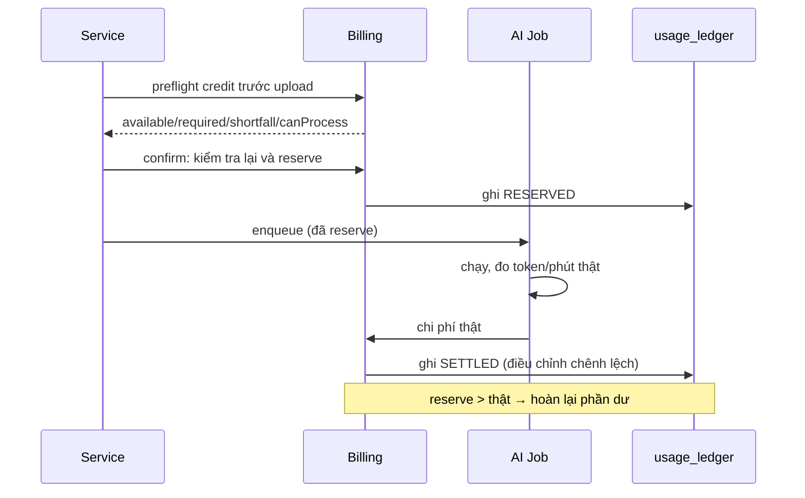
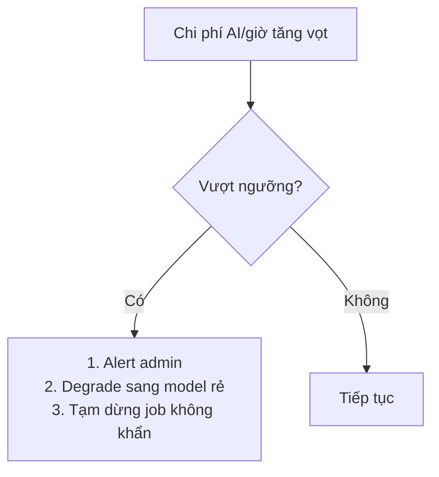

# 10 — Monetization

> Mục tiêu: thiết kế Free, Subscription AI và Custom AI/BYOM, credit model, usage tracking, cost control, profit margin. Custom AI là capability có ở mọi gói; không còn là một gói trả phí độc lập.

---

## 1. Tổng quan 3 mô hình

| Mô hình | Ai trả inference | Doanh thu của bạn | Margin | Vai trò |
|---------|------------------|--------------------|--------|---------|
| **Free** | Bạn (lỗ có kiểm soát) | $0 | Âm (chi phí acquisition) | Phễu, viral, trải nghiệm "wow" |
| **Subscription** | Bạn | Phí tháng (credit markup 2-4x) | Mỏng-vừa | Doanh thu chính |
| **Custom AI/BYOM** | Owner | Không phải nguồn thu riêng bắt buộc | Không phát sinh inference cost cho nền tảng | Mở rộng funnel, power user, quyền chọn provider |

> **Chiến lược tổng:** Free để kéo người vào và tạo khoảnh khắc wow. Subscription là doanh thu cốt lõi và cung cấp Platform Model bằng credit. Custom AI mở cho cả Free và Paid để giảm rào cản tiếp cận, chuyển inference cost sang Owner và tạo đường dùng cho người đã có provider riêng; đây là capability bổ trợ, không phải paywall riêng.

---

## 2. Free Plan — thiết kế phễu + chống abuse

Ba mục tiêu mâu thuẫn cần cân bằng: **cho đủ để wow**, **giữ chân**, **không cháy túi**.

### Giới hạn đề xuất (theo đơn vị chi phí thật, không theo "số lần")

| Hạn mức | Free | Lý do |
|---------|------|-------|
| STT (phút/tháng) | 30–60 phút | STT là chi phí đắt nhất → siết chặt nhất |
| Tài liệu (trang/tháng) | ~100 trang | Rẻ → rộng tay hơn |
| Câu hỏi Tutor/tháng | ~20–30 | Đủ trải nghiệm RAG |
| Quiz/flashcard từ nội dung đã có | Không giới hạn | Dùng lại nội dung đã sinh = gần như miễn phí |
| Lưu trữ | 1–2 GB | File gốc |
| Số document đồng thời xử lý | 1 | Chống spam hàng đợi |

> **Nguyên tắc thiết kế quota:** Giới hạn theo **đơn vị chi phí thật** (phút STT, trang, token), không theo "số quiz". Vì một video 2h và một PDF 1 trang tốn chi phí khác nhau 100 lần. "5 quiz/tháng" là quota ngây thơ — user upload video 3h vẫn lọt. "30 phút STT/tháng" mới chặn đúng chỗ đau.

### Giữ chân (retention) trong giới hạn

- Cho trải nghiệm **đầy đủ tính năng** nhưng **giới hạn dung lượng** (không khóa tính năng — khóa lượng). User phải *cảm nhận được giá trị* của interactive video, mới chịu trả tiền.
- Streak học tập, nhắc ôn flashcard (SRS) → tạo thói quen quay lại (chi phí ~0).
- Hiển thị "bạn đang yếu X" (analytics) → tạo lý do nâng cấp để học sâu hơn.

### Chống abuse Free

| Vector | Phòng chống |
|--------|-------------|
| Tạo nhiều account farm quota | Verify email bắt buộc; giới hạn theo IP/thiết bị; phát hiện pattern |
| Upload video dài đốt STT | Hard cap phút STT + giới hạn thời lượng/file |
| Bot spam API | Rate limit + CAPTCHA khi nghi ngờ |
| Lách quota reset | Quota theo rolling window, không reset mốc cố định dễ lách |

> **Bài học phễu:** Free plan tốt = "đủ ngon để nghiện, đủ giới hạn để khao khát". Cho quá nhiều → không ai nâng cấp + cháy túi. Cho quá ít → không kịp wow → bỏ đi. Đòn bẩy đúng cho sản phẩm này: cho dùng *đủ một video tử tế* để thấy interactive checkpoint thần kỳ, rồi giới hạn lượng để muốn thêm.

---

## 3. Subscription AI Plan — Credit Model

### Vì sao dùng credit, không phải "unlimited"

"Unlimited AI" với chi phí biến đổi = tự sát (một power user đốt sạch lãi của 100 user khác). Credit chuẩn hóa mọi loại công việc về một đơn vị, cho phép kiểm soát chi phí và minh bạch với user.

### Công thức quy đổi credit

Nguyên tắc: **1 credit = một đơn vị chi phí nội bộ cố định** (vd 1 credit ≈ $0.001 chi phí thật), rồi tính credit cho mỗi tác vụ = chi phí thật × **markup 2–4x**.

| Tác vụ | Chi phí thật (≈) | Credit tính (markup ~3x) |
|--------|------------------|--------------------------|
| STT 1 phút | $0.006 | ~18 credits |
| Embedding (cả tài liệu) | ~$0 | ~1 credit (làm tròn) |
| Sinh quiz (1 lượt, model rẻ) | $0.10 | ~300 credits |
| Tutor 1 câu hỏi | $0.005 | ~15 credits |
| Sinh exam | $0.15 | ~450 credits |

(Con số minh họa cách tính — calibrate theo giá thực + định vị giá.)

### Gói đề xuất (giá VN)

| Gói | Giá/tháng | Credits | Phù hợp |
|-----|-----------|---------|---------|
| Free | 0đ | ~1.000 (≈30 phút STT) | Thử nghiệm |
| Basic | ~79k VND (~$3) | ~30.000 | Sinh viên dùng đều |
| Pro | ~149k VND (~$6) | ~80.000 | Người học nghiêm túc |
| Credit top-up | mua thêm | theo gói | Power user vượt hạn |

> **Bài học pricing:** Markup 2-4x trên chi phí thật để bù: định phí hạ tầng phân bổ, chi phí acquisition, support, và lãi. Đừng định giá = chi phí thật (lỗ chắc). Credit còn cho phép **rollover một phần** (giữ chân) và **top-up** (doanh thu thêm từ power user). Minh bạch hiển thị "việc này tốn X credits" giúp user tin tưởng và tự điều tiết.

---

## 4. Custom AI/BYOM — capability cho mọi gói

Owner kết nối API key/endpoint OpenAI-compatible riêng. Custom AI có ở Free và Paid, không trừ platform credit; provider của Owner có thể tính phí trực tiếp.

**Thời điểm triển khai:** Khi identity, secret-management, admin feature setting và egress boundary đã sẵn sàng. Contract đầu tiên là OpenAI-compatible `base_url` + API key tùy chọn + model. Native Anthropic/Gemini adapter và Local AI Connector để phase sau (ADR-0021).

### Ưu / Nhược

| Ưu điểm | Nhược điểm |
|---------|-----------|
| Không phát sinh inference cost cho nền tảng | Phải quản lý & **mã hóa key** của Owner (rủi ro bảo mật) |
| Hợp B2B/doanh nghiệp (dữ liệu không rời nhà cung cấp họ chọn) | Chất lượng output biến thiên theo model user chọn |
| Không lo cost spike inference | Support phức tạp (lỗi từ provider của user) |
| Owner dùng được model phù hợp nhu cầu | Chất lượng hỗ trợ phụ thuộc mức tương thích OpenAI-compatible |
| Hợp Ollama/vLLM self-host (riêng tư tuyệt đối) | Phải test tương thích nhiều provider |

### Kiến trúc BYOM

**Bảo mật key BYOM (bắt buộc):**
- Mã hóa **at-rest** bằng KMS/Vault (envelope encryption); DB chỉ chứa ciphertext.
- Giải mã **chỉ trong memory** ngay trước khi gọi, không log, không cache plaintext.
- Cho phép user thu hồi/xoay key bất cứ lúc nào.
- Cô lập: lỗi/lạm dụng key user không ảnh hưởng user khác.
- Validate endpoint (chống SSRF khi user nhập self-hosted URL — whitelist scheme, chặn IP nội bộ).
- SaaS không gọi được `localhost` trên máy user: local model cần Local AI Connector outbound đã xác thực hoặc endpoint/tunnel mà worker truy cập được. Self-hosted deployment có thể cho phép private endpoint bằng policy riêng.
- Chống DNS rebinding và TOCTOU: resolve/validate mọi IP, chặn metadata/link-local/private range theo policy, pin egress qua controlled transport thay vì chỉ validate chuỗi URL một lần.
- Cache/audit dùng provider identity từ provider type + canonical base URL + model + capability version; không hash hoặc log API key.

**Quyền sử dụng:** Custom AI không bị khóa theo plan. Free và Paid dùng cùng capability; khác biệt gói vẫn nằm ở platform credit, quota, lưu trữ, concurrency và các quyền lợi subscription khác. Admin chỉ bật/tắt capability toàn hệ thống, không tạo model chung hoặc truy cập cấu hình Owner.

> **Bài học BYOM:** Mở miễn phí capability không làm giảm yêu cầu bảo mật. Quản lý API key người khác khiến nền tảng trở thành mục tiêu tấn công; mã hóa key, version secret, ownership và SSRF/egress guard là điều kiện tiên quyết.

---

## 5. Usage Tracking

Mọi tác vụ AI phải được đo và ghi sổ — đây là xương sống của cả credit lẫn cost control.

**Bảng `usage_ledger` (append-only, audit):**

| Cột | Ý nghĩa |
|-----|---------|
| user_id, job_id | định danh |
| task_type | STT/EMBED/QUIZ/TUTOR/EXAM |
| status | RESERVED / SETTLED / RELEASED |
| credits_reserved, credits_actual | giữ trước vs thực tế |
| provider, model | nhà cung cấp + model dùng |
| tokens_in, tokens_out, stt_seconds | đơn vị thật |
| cost_usd | chi phí thật (cho margin analysis) |
| created_at | thời điểm |

> **Bài học:** Ledger **append-only** (chỉ thêm, không sửa) là chuẩn cho dữ liệu tài chính — mọi giao dịch credit là một dòng bất biến, số dư = tổng hợp. Điều này cho phép audit, đối soát, và phát hiện bất thường. Ghi cả `cost_usd` thật để biết margin theo từng user/tác vụ — dữ liệu này vô giá để tối ưu giá và phát hiện user lỗ.

---

## 6. Cost Control (bảo vệ chủ động)

| Cơ chế | Tác dụng | Tầng |
|--------|----------|------|
| **Reserve trước, settle sau** | Không chạy job nếu không đủ credit | Trước job |
| **Credit preflight** | Báo sớm trước upload, không khóa số dư | Trước upload |
| **Hard quota theo plan** | Trần tuyệt đối/tháng | Trước job |
| **Content-hash cache** | Không tính tiền cho nội dung trùng | Trong job |
| **Model routing** | Dùng model rẻ mặc định | Trong job |
| **Circuit breaker chi phí** | Ngắt khi tổng cost/giờ vượt ngưỡng | Toàn hệ thống |
| **Per-user anomaly alert** | Cảnh báo user đốt bất thường | Giám sát |
| **Degrade gracefully** | Hết credit → giảm chất lượng/chặn, không sập | UX |

> **Bài học:** Cost control phải là **nhiều lớp chủ động**. Preflight giúp Owner quyết định trước upload; reserve tại confirm chặn job thiếu credit trước enqueue; settle quyết toán usage thật; circuit breaker chặn thảm họa hệ thống. Custom AI không trừ platform credit nhưng vẫn cần rate limit để bảo vệ hạ tầng.

---

## 7. Payment — bối cảnh Việt Nam

| Cổng | Loại | Ghi chú |
|------|------|---------|
| **VNPay / MoMo / ZaloPay** | Nội địa VN | Phổ biến nhất với người Việt; phí thấp; hỗ trợ thẻ nội địa/ví |
| **Paddle / LemonSqueezy** | Merchant of Record | Nhận thẻ quốc tế + **lo thuế GTGT/VAT giúp** — rất tiện cho dev cá nhân |
| **Stripe** | Quốc tế | Hỗ trợ VN hạn chế; cân nhắc khi mở global |

**Khuyến nghị:** MVP dùng **MoMo/VNPay** (người Việt) + **Paddle/LemonSqueezy** (thẻ quốc tế + lo thuế). Tránh tự xử lý thuế/hóa đơn ở giai đoạn 1 dev — đó là lý do Merchant-of-Record (Paddle) đáng dùng dù phí cao hơn.

> **Bài học:** Thanh toán + thuế là phần "buồn tẻ nhưng chết người". Một dev cá nhân không nên tự lo tuân thủ thuế VAT đa quốc gia — Merchant-of-Record (Paddle/LemonSqueezy) đứng tên bán hộ, lo thuế, chỉ trả bạn phần ròng. Đổi lại phí cao hơn — đáng giá để bạn tập trung vào sản phẩm. Với thị trường VN, ví nội địa (MoMo) là bắt buộc vì tỉ lệ dùng thẻ tín dụng thấp.

---

## 8. Liên kết sang tài liệu sau

- Quota/credit enforcement → Billing Context ở `03-service-design.md`.
- Credit reserve/settle saga → `06-event-driven.md`.
- Con số chi phí cơ sở → `09-cost-analysis.md`.
- BYOM key mã hóa → bảo mật ở `07-api-security.md`.
