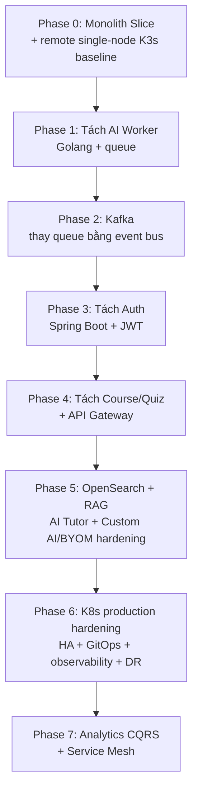

# 11 — Roadmaps

> Mục tiêu: lộ trình MVP theo hướng học sâu nhưng vẫn bám implementation thật. Roadmap này đã cập nhật theo kiến trúc được duyệt: Phase 0 đã có baseline remote single-node K3s dưới `infra/**`, còn Phase 6 là giai đoạn production Kubernetes hardening.

---

## 1. Triết lý roadmap: Vertical Slice → Bóc tách dần

Rủi ro lớn nhất vẫn là ôm quá nhiều khái niệm cùng lúc. Vì vậy roadmap tiếp tục giữ nguyên nguyên tắc:

> Mỗi phase phải kết thúc bằng một hệ thống chạy được trong phạm vi phase đó. Công nghệ mới chỉ được đưa vào khi phục vụ bài học hoặc giảm rủi ro vận hành thật.

### 1.1. Production-grade development, deferred production launch

Roadmap này mô tả thứ tự đưa năng lực vào hệ thống, không cho phép hạ tiêu chuẩn chất lượng.

- Contract, validation và module boundary phải rõ.
- Luồng ghi phải idempotent, có failure handling.
- Background work có resource bound, retry/backoff và graceful shutdown.
- Secret, config và dependency ngoài hệ thống phải fail-fast, không hard-code.
- Mỗi thay đổi quan trọng phải có test phù hợp.

Hệ thống chỉ phục vụ production traffic sau khi hoàn thành core phases và vượt launch gate. Việc đã có baseline K3s sớm không đồng nghĩa đã sẵn sàng production.

### 1.2. Sơ đồ phase cập nhật

---

## 2. Phase 0 — Vertical Slice + Remote K3s Baseline (Tuần 1-4)

Setup guide cho phần remote K3s của Phase 0: `docs/deployment/GUIDE-dev-k3s.md`.

Operations runbook cho phần remote K3s của Phase 0: `docs/deployment/RUNBOOK-dev-k3s.md`.

**Mục tiêu học:** Hiểu end-to-end product flow và đồng thời chốt boundary hạ tầng tối thiểu cho remote dev/stg-like VPS.

**Kiến trúc ứng dụng:** Một app NestJS duy nhất theo modular monolith.

**Kiến trúc hạ tầng Phase 0:**

- local developer loop vẫn dùng `docker compose`,
- remote dev/stg-like VPS dùng Ansible-managed single-node K3s,
- chỉ chạy workload stateless `web`, `api`, `worker`,
- PostgreSQL dùng Aiven managed service bên ngoài cluster,
- secret runtime lấy từ AWS SSM Parameter Store SecureString qua ESO exact key mapping,
- monitoring tái sử dụng Prometheus/Grafana hiện có trên host, chỉ bổ sung `node-exporter` nếu host chưa có và `kube-state-metrics` trong K3s,
- Compose trong `deploy/` vẫn giữ làm fallback tạm thời cho đến khi cutover K3s được xác nhận.

**Làm gì ở Phase 0:**

- Upload PDF + plain text.
- Extract text từ PDF có text layer.
- Chunk + sinh quiz.
- Hiển thị quiz, làm bài, chấm điểm.
- Auth tạm trong monolith.
- Chuẩn hóa baseline remote VPS theo `infra/README.md`.
- Hoàn thiện cost-guard tối thiểu: credit preflight, reserve trước enqueue, trạng thái lỗi rõ và retry chủ động.
- Xây Custom AI OpenAI-compatible baseline cho mọi gói khi ownership, secret-management, verification, feature setting và egress guard tối thiểu đã sẵn sàng.

**Ràng buộc bắt buộc:**

- không đưa PostgreSQL, PVC hoặc stateful workload vào K3s,
- không dùng Terraform,
- Ansible phải idempotent: `state: present`, facts detection, handler chỉ chạy khi có thay đổi, pin version và checksum, hỗ trợ rerun và check-mode,
- không claim remote deployment đã chạy thật,
- không claim Aiven remote connectivity đã chạy thật.

### 2.1. Trạng thái Aiven ở cuối Phase 0

Application support cho Aiven TLS hiện đã có và đã được kiểm tra cục bộ. Để hoàn tất hướng Aiven trên remote còn cần:

1. operator đưa CA thật vào SSM,
2. operator allowlist đúng IP thật của VPS,
3. operator chạy remote rollout và smoke test end-to-end trên host thật.

Trong lúc ba bước này chưa diễn ra, tài liệu vẫn chỉ được mô tả Aiven là target architecture đã được code xong ở mức repository, chưa phải trạng thái remote đã vận hành xong.

---

## 3. Phase 1 — Tách AI Worker (Tuần 5-7)

**Mục tiêu học:** Tách workload nặng khỏi API và học concurrency.

**Thay đổi:** Tách AI Processing thành service Go riêng, giao tiếp qua queue đơn giản trước khi vào Kafka.

**Bài học chính:** Service separation theo workload profile, async job, concurrency, idempotency, graceful shutdown.

---

## 4. Phase 2 — Giới thiệu Kafka (Tuần 8-10)

**Mục tiêu học:** Event-driven architecture chính danh.

**Thay đổi:** Thay queue đơn giản bằng Kafka, thêm outbox, idempotent consumer, retry topics và DLQ.

**Bài học chính:** Partition key, ordering, at-least-once, outbox, retry/DLQ, correlation ID.

---

## 5. Phase 3 — Tách Auth Service (Tuần 11-13)

**Mục tiêu học:** Polyglot service và security foundation.

**Thay đổi:** Tách Auth thành Spring Boot service với JWT và JWKS.

**Bài học chính:** Spring Security, JWT/JWKS, refresh rotation, polyglot interop.

---

## 6. Phase 4 — Tách Course/Quiz + API Gateway (Tuần 14-17)

**Mục tiêu học:** Hoàn tất service boundary chính và edge layer.

**Thay đổi:** Tách Course Service, Quiz Service và thêm API Gateway.

**Bài học chính:** Database-per-service, API Gateway, rate limit, tránh distributed monolith.

---

## 7. Phase 5 — OpenSearch + RAG Tutor + Custom AI/BYOM Hardening (Tuần 18-21)

**Mục tiêu học:** Search, RAG production, NLP tiếng Việt và secret boundary cho provider ngoài.

**Thay đổi:** Thêm OpenSearch, embedding pipeline, AI Tutor; hoàn thiện Custom AI/BYOM với identity thật, secret-management, admin feature setting, egress control và vận hành production. Capability không bị giới hạn theo plan; Free và Paid đều được dùng.

**Bài học chính:** Hybrid retrieval, tenant-safe retrieval, encrypted provider secret, egress control.

---

## 8. Phase 6 — Kubernetes Production Hardening (Tuần 22-25)

**Mục tiêu học:** Nâng baseline K8s sớm ở Phase 0 lên mức production thật.

Phase 6 không phải lần đầu có K8s. K3s single-node đã xuất hiện từ Phase 0 cho remote dev/stg-like VPS. Giai đoạn này tập trung vào hardening và mở rộng:

- multi-node hoặc HA phù hợp,
- HPA cho stateless workload,
- KEDA cho worker queue-driven,
- GitOps,
- full observability: metrics, logs, traces, alerting,
- backup, restore và DR hardening,
- ingress, policy, rollout strategy và operational guardrail ở mức production.

**Bài học chính:** Scale theo đúng metric, chuẩn hóa production ops, rollback, restore và readiness gate thực sự.

---

## 9. Phase 7 — Analytics CQRS + Service Mesh (Tuần 26+)

**Mục tiêu học:** CQRS read model và service mesh như phần mở rộng nâng cao.

**Thay đổi:** Tách Analytics read model, thêm mesh nếu thực sự cần cho mục tiêu học.

**Bài học chính:** CQRS, materialized view, mTLS, traffic split, observability L7.

---

## 10. Bảng tổng hợp roadmap

| Phase | Tên | Concept mới | Ghi chú hạ tầng |
| --- | --- | --- | --- |
| 0 | Monolith Slice + remote K3s baseline | Vertical slice + remote infra baseline | Local dùng Compose, remote VPS dùng single-node K3s, Compose còn là fallback |
| 1 | Tách AI Worker | Async worker, concurrency | Không đổi boundary Phase 0 của remote VPS |
| 2 | Kafka | EDA, outbox, DLQ | Chuẩn bị dữ liệu cho scale queue-driven |
| 3 | Tách Auth | Polyglot, JWT/security | Tăng complexity bảo mật |
| 4 | Course/Quiz + Gateway | Service boundary, BFF | Edge và quota rõ hơn |
| 5 | OpenSearch + RAG + Custom AI/BYOM hardening | Search, RAG, provider boundary | Hoàn thiện secret/egress/admin boundary; capability có ở mọi gói |
| 6 | K8s production hardening | HA, autoscaling, GitOps, observability, DR | Không phải first K8s introduction |
| 7 | Analytics CQRS + Mesh | CQRS, mesh | Mesh vẫn là optional learning track |

---

## 11. Ghi nhớ quan trọng khi triển khai

- Local dev loop vẫn dùng Compose.
- Remote dev/stg-like VPS dùng K3s theo `infra/README.md` sau khi cutover được thực thi.
- Compose chưa bị xóa vì vẫn là fallback tạm thời.
- Không được tuyên bố Aiven remote connectivity đã hoạt động cho tới khi operator rollout thật và smoke test xong.
- Không được diễn giải Phase 6 như thời điểm đầu tiên hệ thống chạm Kubernetes.

---

## 12. Tổng kết

Roadmap sau khi cập nhật vẫn giữ tinh thần học sâu theo từng lớp, nhưng không còn mâu thuẫn với baseline hạ tầng mới. Local vẫn đơn giản với Compose, remote dev/stg-like VPS chuẩn hóa sớm bằng single-node K3s, còn production thật sự chỉ đến sau giai đoạn hardening ở Phase 6.
