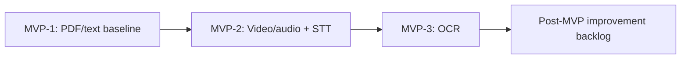

# 11 — MVP Shipping Roadmap

> Nguồn sự thật cho thứ tự giao năng lực MVP. ADR vẫn thắng tài liệu này khi có mâu thuẫn; riêng `docs/adr/0023-postgresql-durable-work-queue-contract.md` giữ nguyên technical queue contract.

---

## 1. Quyết định rebaseline

Mục tiêu hiện tại là đưa một MVP có giá trị học tập đến người dùng, không hoàn thành trước toàn bộ giáo trình distributed systems. MVP giữ modular monolith hiện có, một AI Worker Golang và PostgreSQL durable queue; chỉ mở rộng năng lực xử lý nguồn theo từng lát có thể kiểm chứng.

Nguyên tắc thực thi:

- Mỗi capability phải hoàn tất end-to-end: ingest, xử lý nền, Quiz grounded có Citation, Attempt và Grading.
- Không thay đổi API/ownership/idempotency chỉ để thêm loại nguồn mới.
- Không mở rộng hạ tầng trong MVP. Baseline remote hiện có chỉ được sửa để vận hành an toàn capability đã chốt, không thêm broker, datastore, cluster topology hay platform vận hành mới.
- Production-grade trong phạm vi lát đang làm không đồng nghĩa production launch hay mở rộng production infrastructure.

## 2. Nền tảng MVP giữ nguyên

| Thành phần | Quyết định MVP |
| --- | --- |
| API và domain | Modular monolith hiện có, giữ Owner, Document, Quiz, Attempt và Grading contract |
| Xử lý nền | AI Worker Golang với bounded concurrency, cancellation, readiness và graceful shutdown |
| Hàng đợi | PostgreSQL durable queue theo ADR-0023; at-least-once và idempotency vẫn bắt buộc |
| Lưu trữ | PostgreSQL là durable boundary, object storage giữ source object |
| AI output | `ai.chunks.text` là source of truth; Quiz grounded có Citation tự chứa |
| Hạ tầng | Giữ baseline hiện hữu, đóng băng mọi expansion không cần thiết cho MVP |

## 3. Chuỗi capability MVP

### MVP-1 — PDF/text baseline

**Outcome:** Owner upload PDF có text layer hoặc plain text, nhận Quiz MCQ grounded có Citation, làm Attempt và nhận Grading tất định.

**Bao gồm:** forward/return seam, PostgreSQL queue, Go worker, extraction PDF/text, chunk/generation/validation, retry an toàn, status/error và bounded lifecycle.

**Không bao gồm:** scan PDF/OCR, Video/Audio/STT, Retrieval/RAG hay hạ tầng mới.

**Gate:** chứng minh `Document → PostgreSQL queue → Go worker → Quiz → Attempt → Grade`, gồm duplicate delivery, crash/replay, retry, ownership và graceful shutdown.

### MVP-2 — Video/audio và STT

**Outcome:** Owner xử lý được Video hoặc Audio; STT tạo `ExtractedSegment` có time Locator, rồi dùng lại downstream chunk, grounded Quiz, Citation, Attempt và Grading của MVP-1.

**Bao gồm:** ingest validation cho Video/Audio, STT, time-based Citation, job progress/failure/retry tương thích và kiểm thử nguồn tiếng Việt đại diện.

**Không bao gồm:** VideoCheckpoint, Retrieval/RAG, Kafka hoặc thay đổi queue envelope/contract của ADR-0023.

**Gate:** fixture Video/Audio cho transcript và time Locator; E2E tạo Quiz có Citation theo thời gian; retry/replay không tạo Quiz hoặc Question trùng.

### MVP-3 — OCR

**Outcome:** Owner xử lý được PDF scan hoặc ảnh tài liệu qua OCR, sau đó dùng cùng pipeline grounded Quiz của MVP-1.

**Bao gồm:** source validation, OCR extraction thành `ExtractedSegment` có page Locator, quality/failure classification và retry an toàn.

**Không bao gồm:** DOCX/PPTX/XLSX, taxonomy tài liệu, RAG hoặc infrastructure expansion.

**Gate:** fixture scan/OCR có Citation trang đúng; chất lượng đầu ra và lỗi OCR được hiển thị/retry theo contract Document hiện có; replay vẫn idempotent.

## 4. Post-MVP Improvement Backlog

Những hạng mục sau được đặt tên rõ là **Post-MVP Improvement Backlog**. Chúng không được kéo vào capability MVP qua thay đổi tiện tay hay “chuẩn bị trước”.

| Nhóm | Hạng mục hoãn |
| --- | --- |
| Transport và cache | Redis, Kafka, retry topic/DLQ Kafka |
| Service boundary | Spring Boot auth split, JWT/JWKS migration, Course/Quiz service split, API Gateway |
| Search và AI nâng cao | OpenSearch, embedding, Retrieval/RAG, AI Tutor |
| Scale và vận hành | KEDA, HPA, HA/multi-node, GitOps, service mesh, full production observability/DR |
| Kiến trúc dữ liệu | Analytics CQRS, read model chuyên biệt |
| Product mở rộng | VideoCheckpoint, flashcard, Course/Learning Path, DOCX/PPTX/XLSX, advanced billing/model routing |

Mỗi hạng mục chỉ được chuyển khỏi backlog khi có problem statement, đo lường nhu cầu và ticket riêng; không coi là điều kiện hoàn tất MVP.

## 5. Đóng băng hạ tầng MVP

Trong MVP, không thêm Redis, Kafka, OpenSearch, database/broker mới, KEDA/HPA/HA, GitOps, mesh hoặc service runtime mới. Không thay đổi topology K3s/VPS chỉ để “sẵn sàng scale”.

Cho phép sửa hạ tầng khi và chỉ khi cần để giữ an toàn, khắc phục lỗi hoặc vận hành capability đã chốt trên baseline hiện hữu. Các sửa đổi đó phải giữ nguyên boundary: workload stateless, PostgreSQL ngoài cluster và không thêm stateful platform component.

## 6. Bảng theo dõi và tiêu chí đóng MVP

| Capability | Theo dõi | Hoàn tất khi |
| --- | --- | --- |
| MVP-1 PDF/text baseline | #19 và các issue implementation MVP-1 | Go worker + PostgreSQL queue xử lý PDF/text E2E với evidence contract và lifecycle |
| MVP-2 Video/audio + STT | capability issue riêng | Transcript/time Citation, E2E và retry/replay evidence |
| MVP-3 OCR | capability issue riêng | OCR/page Citation, E2E và retry/replay evidence |

MVP chỉ hoàn tất khi cả ba capability có evidence product và technical/operational phù hợp, không có regression của ownership, idempotency, Citation, Attempt hoặc Grading. Các item Post-MVP không phải completion gate.

## 7. Ghi nhớ khi triển khai

- PostgreSQL queue và Go worker là lựa chọn MVP, không phải bước đệm bắt buộc phải thay bằng Kafka trước khi shipping.
- Video/Audio/STT đứng sau PDF/text để tái sử dụng pipeline; OCR đứng sau STT để cô lập rủi ro chất lượng extraction.
- ADR-0023 là technical queue contract bất biến trong lần rebaseline này.
- Không tuyên bố production launch, remote rollout hay capacity/HA readiness khi chưa có bằng chứng riêng.
